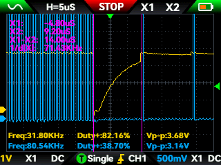
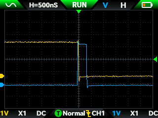

# Kunlun Keyboard Reverse Engineering

This repository contains documentation based on reverse engineering the Kunlun keyboard from YDKB / KBDfans.

My Kunlun stopped functioning after one too many [ESD strikes](https://en.wikipedia.org/wiki/Electrostatic_discharge) approximately 3 years into ownership. The journey to create this documentation started because I wanted to bring my keyboard back to life, and there were no replacement parts.

The failure mode presented as "ghost" key presses. Pressing one key anywhere on the PCB with the failed shift register(s) would register many or all (depending on the duration of the keypress) keys from the same PCB.

As I began the repair, I realized that the design was not something I had seen before, nor was it one commonly seen in the mechanical keyboard community (for good reason, see the section below on shift registers). It is remarkably simple, and therefore remarkably easy to diagnose and repair.

## Updated Firmware
During this process, I also ported the [original firmware written by YDKB](https://github.com/yangdigi/vial-qmk-v5/tree/ava) to the latest version of Vial. QMK has grown a lot since Kunlun was introduced, so it required some optimization and feature set choices to be made to fit within the microcontroller constraints. 

My port can be found here: https://github.com/project802/vial-qmk

A prebuilt image is here: https://github.com/project802/vial-qmk/keyboards/ydkb/kunlun/prebuilt/ydkb_kunlun_vial.bin.

To update the firmware:

- Rename firmware image to "kunlun.bin".
- Unplug the keyboard
- Press and hold the ESC key
- Plug in keyboard
- Copy (or drag and drop) the firmware image onto the storage device presented by the keyboard

## Design

### Major Components

**Microcontroller - Atmel Mega32U4-AU** ([datasheet](https://github.com/project802/kunlun/blob/main/spec%20sheets/Atmel-7766-8-bit-AVR-ATmega16U4-32U4_Datasheet.pdf))

A basic 8-bit microcontroller that is commonly seen in keyboards that support QMK. KBDfans used the TQFP44 package and placed it on a small PCB just for the usb interface, power supply, and microcontroller.

Kunlun uses the internal oscillator and only operates at 8 MHz, as VCC is connected to a regulated 3.3V supply and 16 MHz would require > 4.5V.

**Shift Registers - 74HC595** ([datasheet](https://github.com/project802/kunlun/blob/main/spec%20sheets/FM%2074HC595A.pdf))

When is a 74HC595 not a 74HC595? When its the one used on this keyboard. Apparently, [FM](https://www.superchip.cn/frontEn/index) decided to usurp the identifier and make something that is almost the same, but isn't. It uses open drain outputs (instead of push/pull) and also doesn't have either a latch clock nor output enable. 

The part is available on [LCSC](https://www.lcsc.com/product-detail/C110383.html).

This drove almost the entirety of why I went on the reverse engineering journey. The faulty shift registers were replaced with standard parts, and the keyboard had the same failure symptoms. After much head scratching, I figured they had to be open drain outputs and searched Google to [find a Facebook post](https://www.facebook.com/groups/955185619738067/posts/1121342913122336/) and [an EEVblog thread](https://www.eevblog.com/forum/projects/when-is-a-74hc595-not-a-74hc595/) that confirmed my suspicion. 

### Theory of Operation

The matrix is scanned entirely using only 3 GPIO. 

- PB1 - Serial data clock
- PB2 - Right PCB input, pull-up enabled
- PB3 - Left PCB input, pull-up enabled OR serial data

Serial clock and data are sent to the left and right PCB in parallel.

All switches on the right PCB have one side tied to a unique shift register output, and the other to PB2.

All switches on the left PCB have one side tied to a unique shift register output, and the other to PB3 through a 2.2kOhm resistor.

The shift registers on each PCB are run in serial so that shifting the test bit goes through each output sequentially.

Pressing a key acts as a jumper between its corresponding shift register output with the appropriate microcontroller input. If the shift register output is open drain (the bit is set to one), voltage at the microcontroller is not affected and remain logically high. If the shift register output is driven low (the keypress test bit, zero) then it will pull down the appropriate microcontroller input.

**Scanning**

- The matrix scan starts with clocking in the keypress test bit, a zero, by driving PB3 low and pulsing the PB1 data clock. PB3 is turned around to an input with pull-up.
- Both PB2 and PB3 inputs are evaluated for a keypress.
- The keypress test bit is shifted down one position in the shift register banks by driving PB3 high, pulsing the PB1 clock, then turning PB3 back to an input with pull-up.
- The loop of evaluate and shift continues until all register outputs have been scanned: the greater of the left (32) and right (40) outputs is 40 iterations.

That's it. It is arguably slower than a typical row/col matrix, but it can still be completed in short order (optimized to approximately 350 microseconds in my port) so it doesn't present any meaningful lag as the USB HID interface runs on a 1 millisecond interval. As a result, the stock and ported firmware restrict the scan rate to no faster than 1 kHz.

## Diagnosing a failed board

The photos in this section display the behavior of stock firmware. My ported firmware has different waveforms and sequences.

In my case, the microcontroller appeared to have full function so my focus was on the left and right PCBs. 

The right PCB was the closest to where the final ESD strike occurred so that is also where I started checking. There was no visible physical damage, so the first tests were to probe the various pins on the shift registers.

Starting with the first register in the chain, U24, verify inputs on pins 11 (clock) and 14 (data). You should see something similar to below.

The data (yellow trace) can be seen driving low, clocked in, and slowly rising due to the weak pull-up.

Next, check pin 9 to make sure the IC is shifting the bit out and into the next one in the chain. In my case, this was part of the failure mode. It was not outputting anything but low so it was clocking in zeros to the next IC, so on and so forth, causing everything to look like it was pressed at the same time. 

Check the outputs of the shift register to make sure they are switching between open drain and driving low. You will need to press a key to connect the output to the pull-up within the micro, otherwise it will look like its driving low the entire time. It isn't! I also had this failure mode where the lines were driving low. It seems my IC had a dead data input internally and was always reading zeros so it latched those to the outputs and shifted it into the next in line.

A good keypress with the input (yellow) and bit clock (blue) is below.

