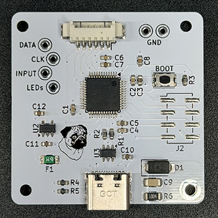

# Kunlun MCU Board Redesign

This is a redesign of the MCU board in the KBDFans Kunlun keyboard with the primary purpose of switching to an STM32F072 processor. The stock ATMega-based design is great, but the part is limited in code space and EEPROM to enable all of the modern Vial features. 

Improvements over the stock design:
* STM32F072 to enable all current Vial features
* Piezo speaker/buzzer
* ESD protection on USB
* Chassis grounding with ESD protection and static buildup mitigation

Otherwise, it reuses the same board geometry, mounting features, and connector locations as stock.

The pug is Moose. He was a good boy.

## Vial Support
### Prebuilt
A prebuilt binary can be found in the prebuilt folder: https://github.com/project802/kunlun/tree/main/prebuilt 

### Build from source
Download my fork of Vial here: https://github.com/project802/vial-qmk

Follow the normal Vial setup instructions. Build the binary with the command below:

        make project802/kunlun:vial

### Flashing
Flash as usual using the STM32 DFU mode.

## Design Files and BOM

Design files were made with KiCad 10. Full schematic and PCB are included.

The BOM is included in the [KiCad design files](kicad/), and as an export in the [production folder](kicad/production/). The export was done with JLCPCB's fabrication output plugin as I primarily use them as my fab house.

[Web-based interactive BOM and layout](https://htmlpreview.github.io/?https://github.com/project802/kunlun/blob/main/mcu%20board%20redesign/kicad/bom/ibom.html) 

[Digikey Full BOM](https://www.digikey.com/en/mylists/list/4LIAA4M82M) - All components including debug features (~$15 USD) 

[Digikey Minimal BOM](https://www.digikey.com/en/mylists/list/V16MMQCCVU) - No debug features and no speaker (~$11 USD)

At the time of writing (5/2026), the cost for 5 boards with a nano coated and electropolished stencil to the US from JLCPCB was $21 USD. Boards alone are $5-$6 shipped.

### Manufacturing Data
FR4, 2 layers, 1.6mm thick, 1 oz copper

PCB Color: white with black silkscreen

## Pinout

*Functional Pins*

| Pin | Function |
|:---:|:---------|
| PA0 | Matrix data / Left PCB input |
| PA1 | Matrix clock |
| PA2 | Right PCB input |
| PA3 | WS2812 LED data |
| PA8 | Speaker output |

*Optional / Debug Pins*

| Pin | Function |
|:---:|:---------|
| PA13 | SWDIO |
| PA14 | SWCLK |
| PB3  | DEBUG_GPIO |
| PB6  | USART1_TX |
| PB7  | USART1_RX |
| PB15 | Speaker Alt (differential drive) |

*Debug Header*

| Pin | Function |
|:-:|:---------|
| 1 | USART1_RX |
| 2 | NRST |
| 3 | DEBUG_GPIO |
| 4 | USART1_TX |
| 5 | VDD (3.3V) |
| 6 | SWCLK |
| 7 | SWDIO |
| 8 | VSS (GND) |
